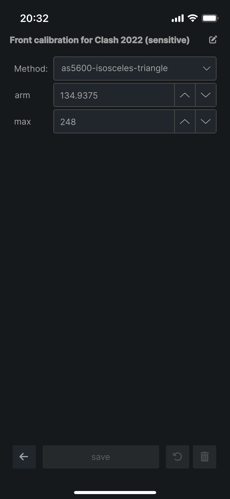

Sufni.Bridge
============

Sufni.Bridge\* is a work-in-progress cross-platform (.NET core / Avalonia) application to process
recorded sessions directly from a [Sufni Suspension Telemetry](https://github.com/sghctoma/sst)
DAQ either via the DAQ's server, or its mass storage device (MSC) mode. As of
now, the application has a limited functionality compared to the
[web-based dashboard](https://github.com/sghctoma/sst/wiki/03-Dashboard), but
it does not require an internet connection.

|  |  |  |  |
|---|---|---|---|

|  |  |  |  |
|---|---|---|--|

Important limitations:

 - No travel and velocity graphs, only histograms and balance
 - No interactive graphs, GPS map, video

\* *Pronounced SHOOF-nee dot bridge. Sufni means tool shed in Hungarian, but
also used as an adjective denoting something as DIY, garage hack, etc.*
